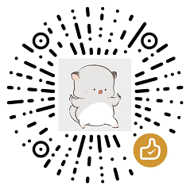

Appreciate me (WeChat)

[⚡️⚡️⚡️ Generating for me ⚡️⚡️⚡️](https://afdian.net/@niuhuan)

My communities

 [Chat to me via discord](https://discord.gg/2RNTxeRhF8)

 [Chat to me via telegram](https://t.me/+yDU25rCecGo5ZDFl)

 [Subscribe telegram channel](https://t.me/+i8b8BMFO6GAzOWFl)

